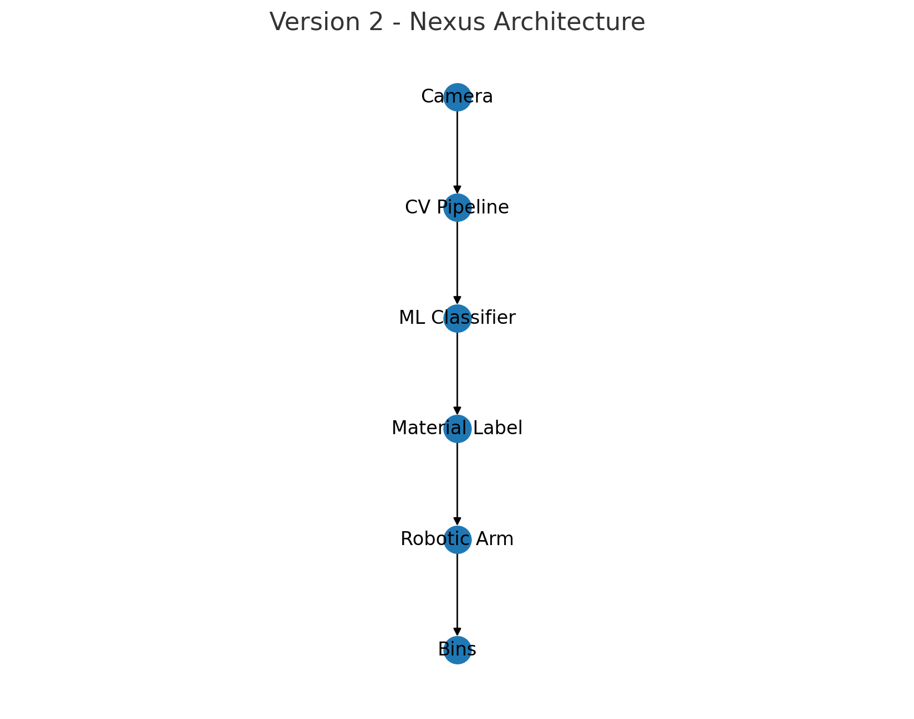
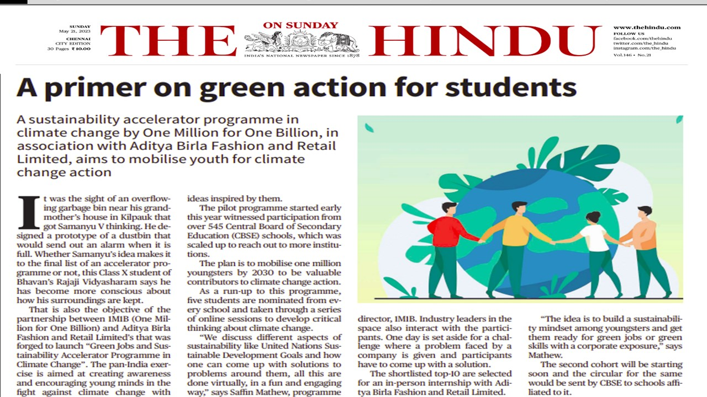

# NEXUS  
Next-Gen Autonomous Waste Segregation Unit  
Version 2 of an intelligent waste management system.

## Overview
NEXUS (Next-Gen Autonomous Waste Segregation Unit) is an AI-powered system designed to classify waste into categories such as plastic, metal, and paper using computer vision and machine learning.  
Once classified, a robotic arm performs automated sorting, directing each item into its respective bin.  
This system represents Version 2 of a two-stage waste management pipeline, extending the baseline capabilities of ORIGIN (Version 1) into a fully autonomous and intelligent solution.

---

## Objectives
- Classify waste using image-based machine learning  
- Automate sorting through a robotic arm  
- Reduce manual waste handling and mis-segregation  
- Create a scalable and deployable model for smart waste management  
- Extend ORIGIN’s overflow-detection capabilities into intelligent material recognition  

---

## Features
- Computer vision pipeline for real-time detection  
- CNN or MobileNetV2-based classifier  
- Dataset-driven training with augmentation  
- Robotic arm for physical sorting  
- Modular architecture for future expansion  
- High accuracy in material classification under controlled lighting  

---

## Tech Stack
- Python  
- TensorFlow / Keras  
- OpenCV  
- Arduino for inference  
- Robotic Arm (Servo-based)  
- Custom dataset (plastic, metal, paper)

---

## Architecture

---

## Dataset
- Approximately 1500+ images across three categories  
- Images captured in varying angles and lighting environments  
- Augmentation applied: rotation, flipping, brightness shift, cropping  
- Split: 80% training, 20% validation  

---

## Model Details
- MobileNetV2 or custom CNN architecture  
- Image size: 224x224  
- Optimizer: Adam  
- Loss Function: Categorical Crossentropy  
- Epochs: 20–35  
- Batch Size: 32  
- Achieved high accuracy across all three categories

---

## Results

| Model         | Accuracy | Precision | Recall |
|---------------|----------|-----------|--------|
| MobileNetV2   | 92.4%    | 91.7%     | 92.1%  |
| Custom CNN    | 89.3%    | 88.4%     | 89.0%  |

---

## Demo

Coming Soon

---

## How It Works
1. The camera captures an image of the waste item.  
2. The image passes through the computer vision pipeline.  
3. The trained model classifies the item into one of the predefined categories.  
4. The classification result is sent to the robotic arm controller.  
5. The arm picks and places the item into the correct bin.

---

---

## Limitations
- Class accuracy may drop in inconsistent lighting  
- Robotic arm placement may misalign with irregular shapes  
- Currently supports only three classes  
- Dataset can be expanded for real-world variability  

---

## Future Improvements
- Add additional waste categories (glass, organic, e-waste)  
- Integrate Vision Transformers  
- Add edge-based deployment via TensorFlow Lite  
- Fully integrate with ORIGIN for a unified waste kiosk  
- Add an IoT dashboard for monitoring bin usage and classification logs  

---

## Project Lineage
This project is Version 2 of a two-stage intelligent waste management system.

- **ORIGIN (Version 1):** A sensor-based smart dustbin for overflow detection and automated lid control.  
- **NEXUS (Version 2):** A machine learning-powered waste classification and robotic sorting system.

NEXUS directly evolves from the limitations of ORIGIN, upgrading the system from simple overflow detection to intelligent material recognition and automated sorting.

---

## Conclusion
NEXUS represents a scalable and practical approach to automated waste management by combining machine learning, computer vision, and robotics.  
This system significantly reduces manual handling, improves segregation accuracy, and forms the foundation for future AI-driven environmental automation.

---

## Newspaper Publication

---

## Source Code
[Python Code](src/main.py)
[Robotic Arm Code](src/robotic_arm_code.ino)

---
